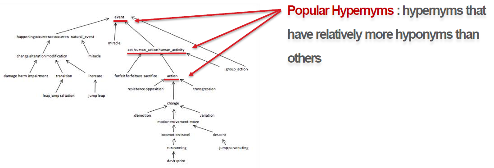
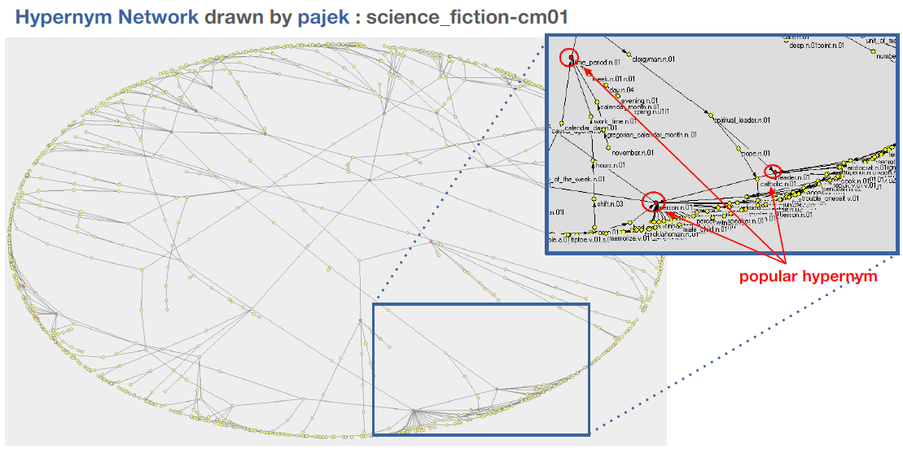

# CS372-Hypernym-Tree

Analysis of the subjects of news articles using hypernym tree.

## Introduction

A hypernym tree is the network where the nodes are the synsets in the hypernym paths obtained from any word in the article and the edges are the relationship obtained from the hierarchy in each hypernym path. Basically, hypernym is a semantic field which includes a word or a phrase as a higher concept. Since words can share a common hypernym at the higher concept, the branch structure can be imagined and the tree structure from the parent node to the leaf node can be drawn. In this research, we considered popular hypernym as the nodes with more children nodes rather than any others. The popular hypernyms will be used to calculate distance to standard hypernym list for each category.

### NLTK Brown corpus

My team is using NLTK Brown corpus to create the standard to classify the news articles. Then we tested with Chosun english news (English version of the news in Korea) and Reuters news to test our result.

We also used [Pajek](http://vlado.fmf.uni-lj.si/pub/networks/pajek/) to draw hypernym tree network.

### This is the characteristic of Brown corpus categories and their hypernym tree.

category | #files | leaves | maxpaths | V | E
-------- | ------ | ------ | -------- | - | -
adventure | 29 | 609.482759 | 16.37931 | 1243.413793 | 1133.241379
belles_lettres | 75 | 649.96 | 15.973333 | 1254.706667 | 1137.626667
editorial | 27 | 708.555556 | 16.555556 | 1347.185185 | 1233.925926
fiction | 29 | 629.896552 | 15.62069 | 1294.172414 | 1193.517241
government | 30 | 563.3 | 15.8 | 998.066667 | 900.633333
hobbies | 36 | 617.694444 | 16.305556 | 1164.527778 | 1067.388889
humor | 9 | 698.111111 | 15.444444 | 1411.444444 | 1291.444444
learned | 80 | 554.0875 | 15.7375 | 1004.175 | 890.525
lore | 48 | 645.270833 | 16.375 | 1228.104167 | 1116.166667
mystery | 24 | 575.083333 | 15.416667 | 1181.708333 | 1081.375
news | 44 | 669.090909 | 16.227273 | 1299.545455 | 1217.068182
religion | 17 | 612.882353 | 16.352941 | 1146.235294 | 1032.588235
reviews | 17 | 768.882353 | 16 | 1460.470588 | 1331.470588
romance | 29 | 586.448276 | 15.551724 | 1215.62069 | 1115.137931
science_fiction | 6 | 631.333333 | 15 | 1235 | 1110.666667

## Documents

1. [Initial proposal](1_NLP_Proposal.pdf): Written in Korean. (Others are written in English)

2. [First Presentation](2_NLP_First_Presentation.pdf)

3. [Final Presentation](3_NLP_Final_Presentation.pdf)

4. [Final Report](4_NLP_Final_Report.pdf)